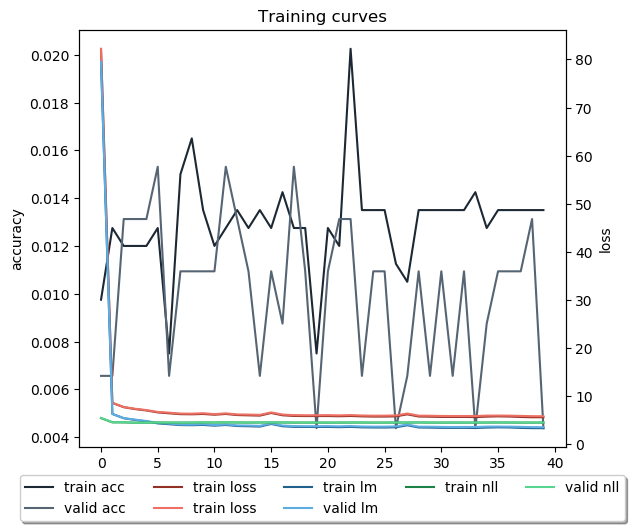

# Model combined_2020-04-20_091250's result page

## Training curves

## Annotation example

**Youtube video:** gZuDMKXWU_E

### Generated captions

Clip #1

> Input sentence >>> <SOS>
> 
> Output sentence >>> add salt flour with the chopped parsley <SEP>
> 
> Ground truth >>>  cut the beef into strips and grind the beef <SEP>

Clip #2

> Input sentence >>>  cut the beef into strips and grind the beef <SEP>
> 
> Output sentence >>> heat them and garlic salt crouton inch pieces and some mayonnaise with milk crumb soft butter and knted the the salt <SEP>
> 
> Ground truth >>>  form the meat into a patty <SEP>

Clip #3

> Input sentence >>>  form the meat into a patty <SEP>
> 
> Output sentence >>> cook the bacon the stalk it together <SEP>
> 
> Ground truth >>>  add pepper and salt to the patty <SEP>

Clip #4

> Input sentence >>>  add pepper and salt to the patty <SEP>
> 
> Output sentence >>> add the loaf and mix it <SEP>
> 
> Ground truth >>>  fry the burger in a pan <SEP>

Clip #5

> Input sentence >>>  fry the burger in a pan <SEP>
> 
> Output sentence >>> add lettuce into thin to a thin pieces <EOS>
> 
> Ground truth >>>  slice the tomatos onions and pickles <SEP>

Clip #6

> Input sentence >>>  slice the tomatos onions and pickles <SEP>
> 
> Output sentence >>> place the hot hot dogs on top <SEP>
> 
> Ground truth >>>  slice the lettuce <SEP>

Clip #7

> Input sentence >>>  slice the lettuce <SEP>
> 
> Output sentence >>> roll the blender <SEP>
> 
> Ground truth >>>  when the bottom turns brown flip the burger <SEP>

Clip #8

> Input sentence >>>  when the bottom turns brown flip the burger <SEP>
> 
> Output sentence >>> roll the avocado <SEP>
> 
> Ground truth >>>  toast the buns <SEP>

Clip #9

> Input sentence >>>  toast the buns <SEP>
> 
> Output sentence >>> put the sliced lettuce with miso and mix <SEP>
> 
> Ground truth >>>  top the patties with cheese <SEP>

Clip #10

> Input sentence >>>  top the patties with cheese <SEP>
> 
> Output sentence >>> spread fil wash together <SEP>
> 
> Ground truth >>>  layer lettuce the patty onion tomato pickle mustard ketchup and the top bun onto the bottom bun <EOS>

