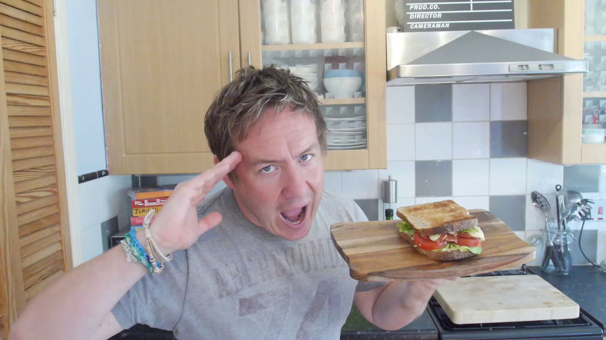
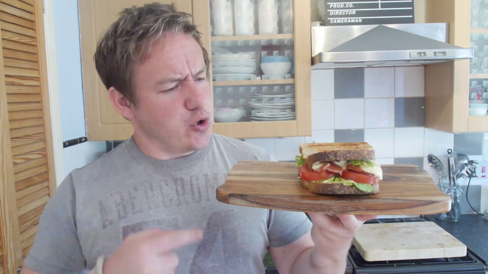
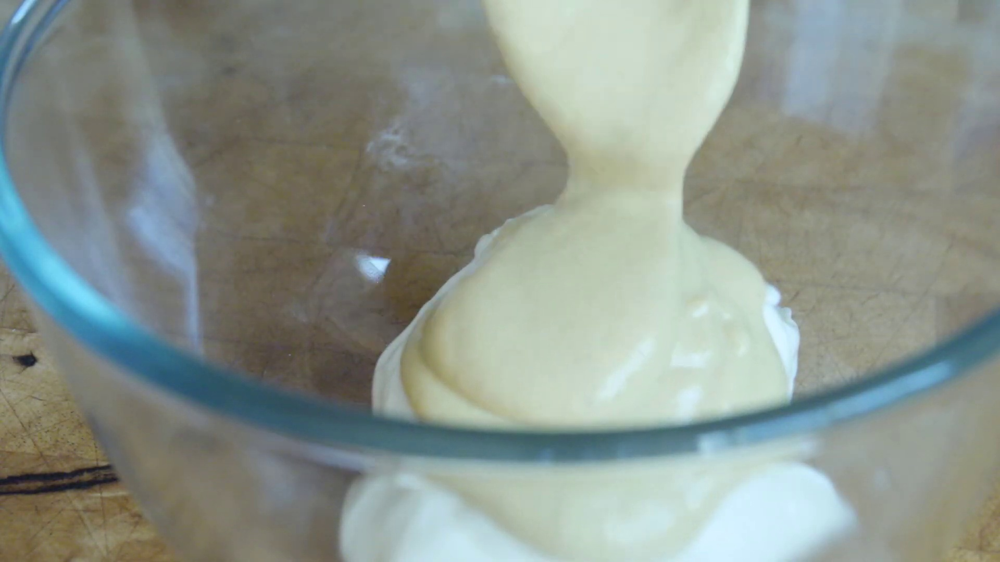
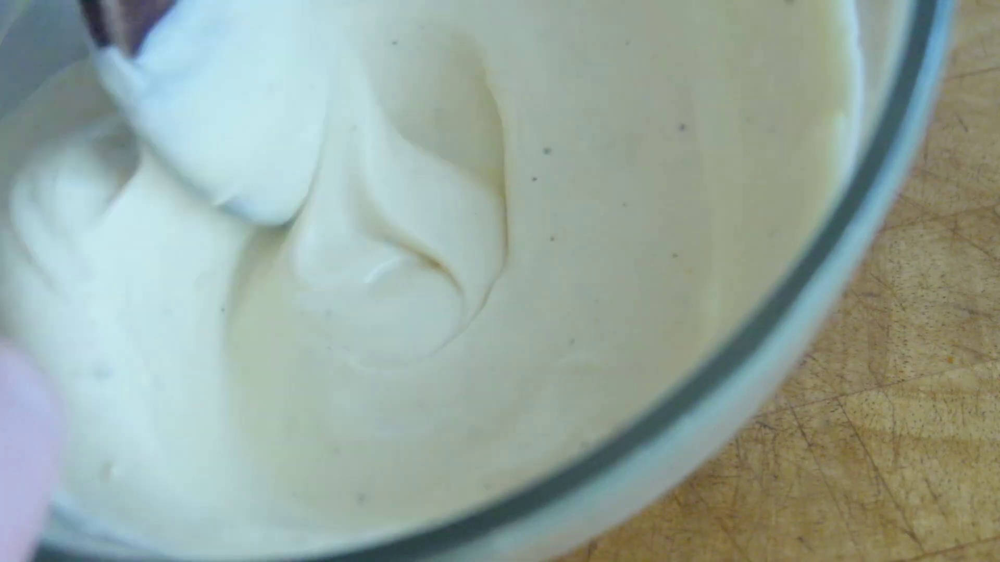
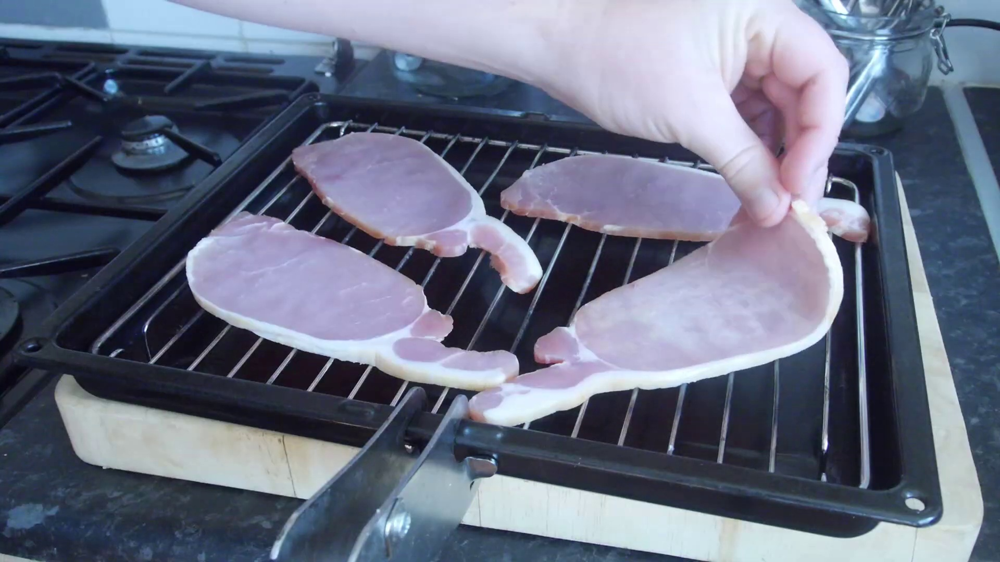
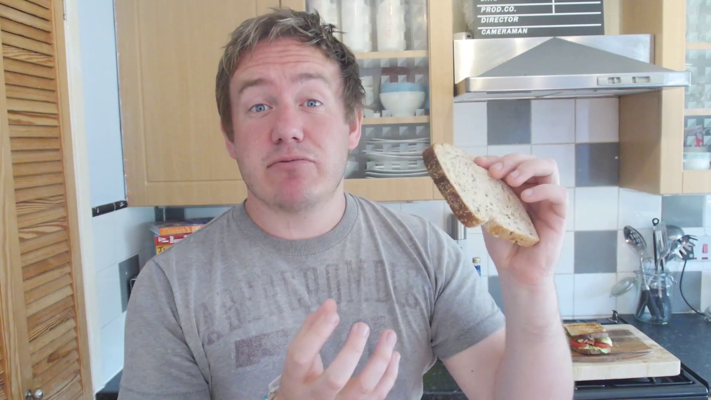
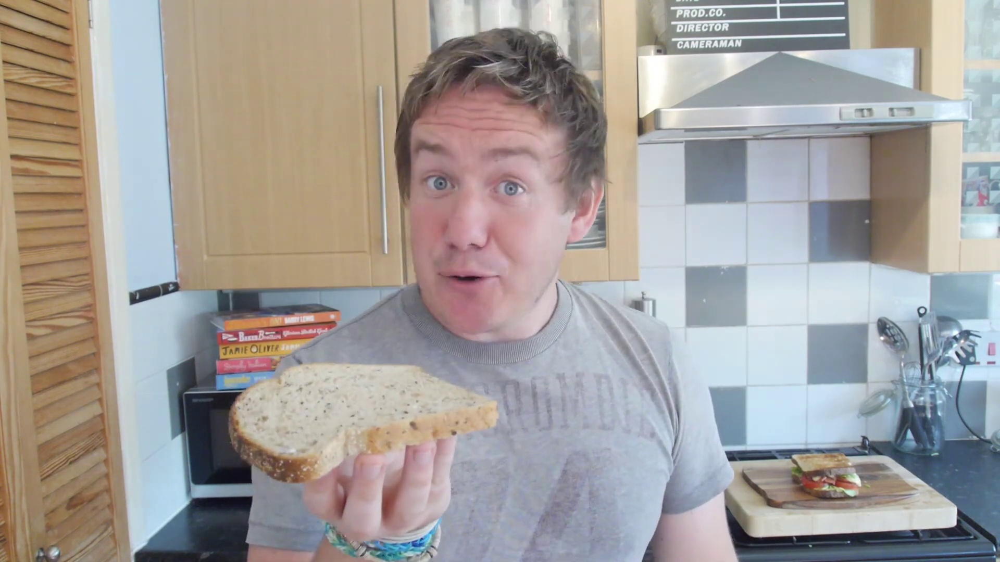
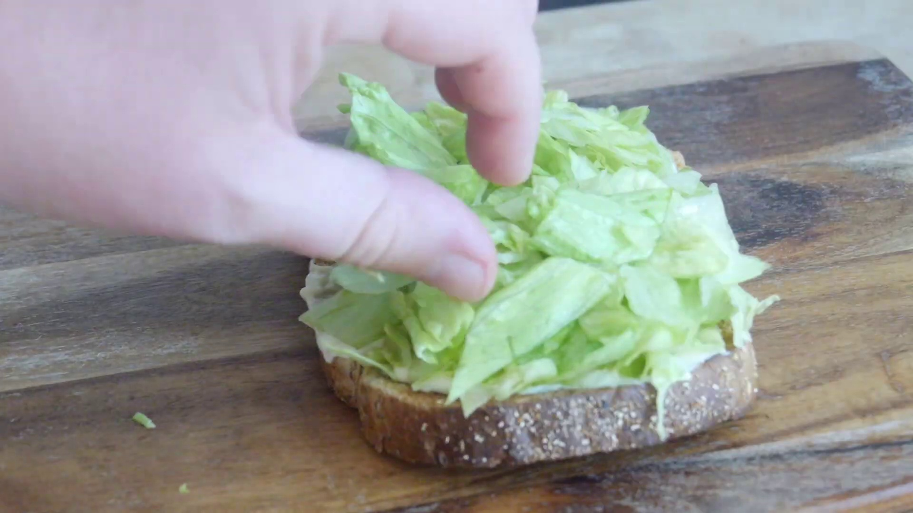
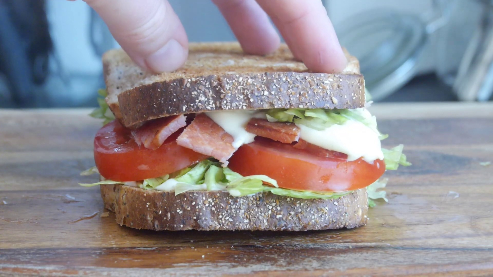
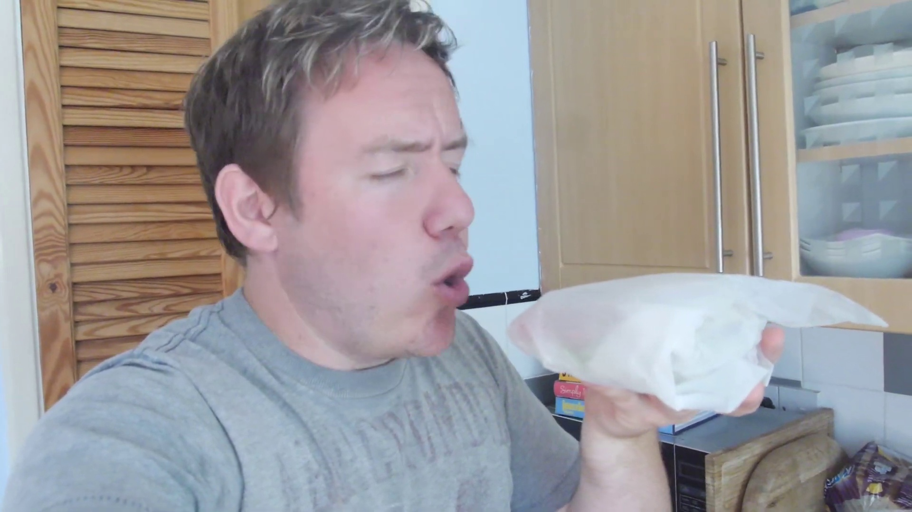

| Frame | Class and Percentage |
:-------------------------:|:-------------------------:
 | amphiuma(8.78%) rhea(4.18%) eastern meadowlark(4.17%) chordate(4.16%) hawk(3.46%) 
 | hepatic tanager(20.18%) European fire salamander(14.45%) shuffleboard(6.52%) piping crow(4.73%) field hockey(4.06%) 
 | chordate(25.96%) amphiuma(18.19%) meadowlark(5.68%) gyrfalcon(5.37%) rhea(4.97%) 
 | chordate(31.10%) gyrfalcon(4.16%) rhea(3.73%) white-rumped shrike(3.54%) raven(3.45%) 
 | chordate(11.95%) Myxine glutinosa(9.62%) amphiuma(4.13%) cotinga(3.05%) Cassin's kingbird(3.02%) 
 | hawk(4.29%) Old World vulture(4.10%) meadowlark(3.98%) Cassin's kingbird(3.51%) chordate(3.05%) 
 | song sparrow(49.48%) limestone salamander(8.87%) common European jay(4.66%) scops owl(3.88%) cock of the rock(2.37%) 
 | gnatcatcher(9.09%) cedar waxwing(8.22%) plains spadefoot(5.59%) European fire salamander(5.48%) tree toad(5.03%) 
 | clay-colored robin(16.25%) flashlight fish(8.08%) cephalochordate(6.74%) Rocky Mountain jay(6.18%) yellow-breasted bunting(4.18%) 
 | cotinga(20.68%) Atlantic manta(8.85%) conodont(4.29%) red-shouldered hawk(2.91%) fetus(2.67%) 
 | chordate(5.43%) hawk(4.36%) tree sparrow(3.55%) shuffleboard(3.16%) wren(2.99%) 
 | white-rumped shrike(10.47%) shark(8.82%) chordate(4.92%) hawk(4.76%) flashlight fish(4.53%) 
 | eastern kingbird(13.97%) amphiuma(12.05%) Myxine glutinosa(11.40%) hawksbill turtle(10.65%) chordate(6.00%) 
 | rhea(42.14%) green frog(37.17%) white-bellied swallow(1.04%) arboreal salamander(1.00%) goliath frog(0.93%) 
 | wood-frog(35.35%) porbeagle(14.75%) obstetrical toad(11.64%) frog(5.11%) eagle ray(4.27%) 
 | carancha(12.55%) cotinga(8.86%) meadowlark(7.39%) hawk(5.70%) leatherback turtle(5.06%) 
 | dicamptodon(89.46%) Pacific giant salamander(4.06%) western red-backed salamander(1.41%) tawny eagle(1.12%) cotinga(1.00%) 
 | Pacific giant salamander(61.97%) western red-backed salamander(18.02%) dicamptodon(16.87%) chordate(0.34%) placoderm(0.28%) 
 | dicamptodon(53.97%) Pacific giant salamander(12.38%) western red-backed salamander(11.30%) chordate(3.42%) Cassin's kingbird(3.30%) 
